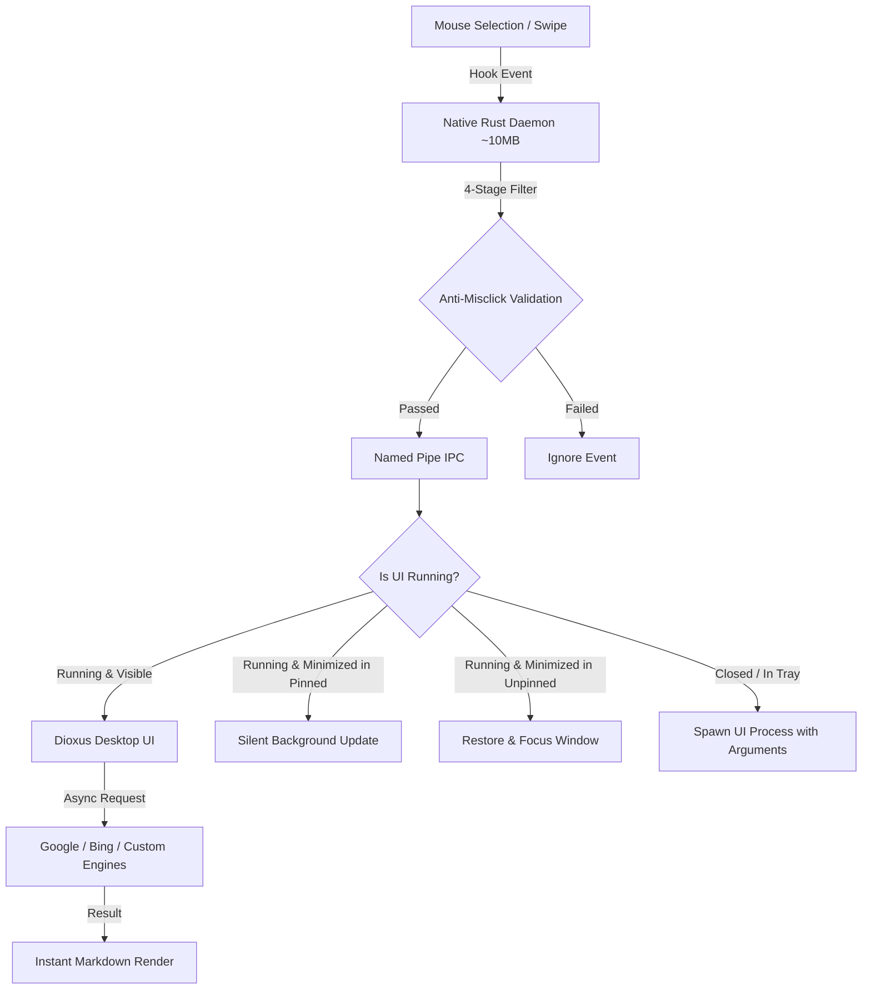

# Translation WordSwipe

<div align="center">


### Fast, Ultra-Lightweight, and Intelligent Desktop Text-Swipe Translation for Windows

[](https://www.rust-lang.org/)
[](https://dioxuslabs.com/)
[](https://microsoft.com/windows)
[](LICENSE)

</div>

---

## 🌟 Overview

**Translation WordSwipe** is a modern, high-performance desktop translation tool designed specifically for Windows. Simply select or swipe any text anywhere on your screen, and an instant translation pops up without breaking your reading workflow.

Built from the ground up in Rust with a decoupled **Dual-Process Architecture**, it delivers instantaneous responsiveness while keeping resource consumption to an absolute minimum: when the translation window is closed, Chromium/WebView2 is completely terminated, leaving only an ultra-lean ~10MB native Rust background daemon.

---

## ✨ Key Features

### 🚀 Dual-Process Decoupled Architecture
- **Native Daemon (~10MB RAM)**: Written in pure Rust with zero WebView2 dependencies. Stays in your system tray to listen for global mouse gestures, hotkeys, and handle configuration.
- **On-Demand Dioxus UI**: Launches the sleek GUI when needed. When you close the window (`[X]`), the entire UI process exits and **all `msedgewebview2.exe` processes are completely terminated**, reclaiming 100% of Chromium memory.

### 🛡️ 4-Layer Anti-Misclick Defense Pipeline
No more annoying accidental popups when you drag a window, move files, or click a button:
1. **Self-Window Suppression**: Ignores any selection inside the application itself.
2. **Foreground Window Movement Check**: Discards events if the active window moved between mouse-down and mouse-up (distinguishing window repositioning).
3. **Physical Distance Threshold**: Requires drag movement exceeding physical pixel thresholds (filters out single clicks).
4. **Clipboard Diff Gatekeeper**: Uses atomic clipboard inspection to confirm actual new text was selected, immediately restoring the user's previous clipboard history.

### 📌 Dual Interaction Modes
| Feature | Unpinned Mode *(Default)* | Pinned Mode *(Research & Reading)* |
| :--- | :--- | :--- |
| **Window Tier** | Standard level (`HWND_NOTOPMOST`); sinks when clicking away. | Always-On-Top (`HWND_TOPMOST`); floats steadily above other windows. |
| **Swipe when Visible** | Brings window forward and refreshes translation. | Updates translation immediately on the topmost window. |
| **Swipe when Minimized** | **Instant Wakeup**: Restores from taskbar to the foreground. | **Silent Mode**: Stays 100% silent in taskbar; never interrupts. |
| **Swipe when in Tray** | Daemon restarts the UI process and displays result. | Daemon restarts the UI process and displays result. |

### 🌐 Multi-Engine Translation
- **Google Translate**: Supports Web Scraper API, official Google Translation API, and custom Cloudflare Workers reverse proxy endpoints.
- **Bing / Microsoft Translate**: Built-in fallback and multi-engine support.
- **Mutual Translation (EN ⇄ ZH)**: Automatically detects English/Chinese and flips translation direction.
- **Custom Translation Sources**: Add your own translation APIs or web endpoints easily in settings.

### 🔍 OCR Workflow Integration
- Automatically monitors common screenshot and OCR tools (e.g. WeChat OCR, Snipaste, PixPin).
- Automatically captures text recognized by OCR windows and triggers immediate translation.

### 🎨 Modern & Flexible Interface
- Developed using **Dioxus 0.7.10** desktop framework.
- **Collapsible & Resizable Sidebar**: Drag or double-click to collapse/expand.
- **Full Right-Click Context Menu**: Right-click to copy, select, inspect, or search.
- **Full Proxy Support**: Seamlessly works with System Proxy or custom SOCKS5/HTTP proxies.
- **Windows Autostart**: Optional one-click toggle to launch on system startup.

---

## 🛠️ Architecture



---

## 📦 Building from Source

### Prerequisites
- **Operating System**: Windows 10 or Windows 11 (x86_64)
- **Rust Toolchain**: Rust 1.80+ (MSVC recommended)
- **WebView2 Runtime**: Installed by default on Windows 10/11

### Compilation

```bash
# Clone the repository
git clone https://github.com/your-username/Translation-WordSwipe.git
cd Translation-WordSwipe

# Check and run tests
cargo test --bin TranslationWordSwipe

# Build optimized release executable
cargo build --release
```

The compiled binary with embedded application manifest and icons will be located at:
```text
target/release/TranslationWordSwipe.exe
```

---

## ⌨️ Shortcuts & Operations

| Action | Result |
| :--- | :--- |
| **Left Click & Drag (Text)** | Swipes and translates selected text across any application |
| **Left Click Tray Icon** | Toggles window visibility (Show / Restore) |
| **Right Click Tray Icon** | Opens menu (Show, Toggle WordSwipe on/off, Exit) |
| **Pin Icon (Header)** | Toggles between Pinned (Always-on-Top) and Unpinned modes |
| **Double-Click Resizer** | Quickly folds or expands the navigation sidebar |

---

## ⚙️ Configuration

Settings are automatically saved in `settings.json` located next to the executable, including:
- Translation engine selections and proxy configurations.
- Pinned mode and window layout preferences.
- OCR keyword monitoring preferences.
- Autostart registry state.

---

## 📄 License

This project is licensed under the [MIT License](LICENSE).